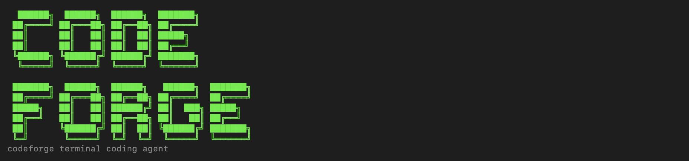

# CodeForge Terminal Agent

CodeForge is a terminal-native coding agent that can inspect a project folder, edit files with approval, run validation commands in the same terminal, and keep the session open until you decide to exit.

It supports Groq by default and can also use an Ollama server for local or self-hosted models.




## Highlights

- Global `codeforge` command that works from any project folder.
- Groq and Ollama provider support.
- Workspace-aware file scanning, file reading, searching, and directory listing.
- File create/update approval with a preview before anything is written.
- Live command output streamed directly in your terminal.
- Compact internal progress ticks instead of noisy agent logs.
- Persistent interactive session: complete a task, then enter another task without restarting.
- Rich-inspired terminal UI with a CodeForge ASCII startup logo.
- Workspace path protection so reads and writes stay inside the current folder.

## Requirements

- Node.js `18` or newer.
- A Groq API key, or a running Ollama server.
- macOS, Linux, or Windows terminal.

Check Node:

```bash
node --version
```

## Installation

Clone the repository:

```bash
git clone https://github.com/YOUR_USERNAME/codeforge-terminal-agent.git
cd codeforge-terminal-agent
```

Install/link the global command:

```bash
npm link
```

Verify:

```bash
which codeforge
```

Run:

```bash
codeforge
```

## Global Setup

Run the setup helper:

```bash
npm run setup
```

This writes your global config to:

```text
~/.codeforge.env
```

Project-level `.env` files are also supported and take priority over the global config.

## Groq Configuration

Create `.env` in a project folder, or use `~/.codeforge.env` globally:

```bash
LLM_PROVIDER=groq
GROQ_API_KEY=your_groq_api_key_here
GROQ_MODEL=llama-3.3-70b-versatile
```

Then run:

```bash
codeforge
```

## Ollama Configuration

For local Ollama:

```bash
LLM_PROVIDER=ollama
OLLAMA_BASE_URL=http://localhost:11434
OLLAMA_MODEL=qwen2.5-coder:1.5b
```

For Ollama running on a server:

```bash
LLM_PROVIDER=ollama
OLLAMA_BASE_URL=http://YOUR_SERVER_IP:11434
OLLAMA_MODEL=qwen2.5-coder:1.5b
```

## Usage

Open any project folder:

```bash
cd /path/to/your/project
codeforge
```

Enter a task:

```text
Task: create a Node script that prints hello world and run it
```

CodeForge will inspect the folder, propose file changes, ask for approval, and run commands only after confirmation.

To quit:

```text
exit
```

or:

```text
quit
```

## What The Agent Can Do

The model can request these internal tools:

```text
LIST_FILES
LIST_DIR path
SEARCH_FILES query
READ_FILE path
WRITE_FILE path
RUN_COMMAND command
FINAL answer
```

These internal tool calls are hidden from normal output. You see compact progress like:

```text
✓ scanned workspace
✓ read package.json
✓ updated src/index.js
✓ ran command: npm test
```

## Command Execution

Commands are streamed live in the same terminal.

Before a command runs, CodeForge shows a command approval panel:

```text
Command Approval
npm test

Run this command? [y/N]
```

If approved, stdout and stderr appear directly in your terminal as the process runs.

## File Update Approval

Before writing a file, CodeForge shows:

- target path
- current file size
- new file size
- preview of the proposed content

Nothing is written unless you approve:

```text
Approve update? [y/N]
```

To disable write approval:

```bash
CODEFORGE_REQUIRE_WRITE_APPROVAL=false codeforge
```

## Safety

CodeForge includes several guardrails:

- File access is restricted to the current workspace.
- Shell commands require approval.
- Common destructive commands are blocked.
- Large files are not read by default.
- Internal scanning output is hidden from the user-facing terminal.

Blocked command patterns include:

```text
rm -rf
git reset
git checkout --
shutdown
reboot
mkfs
dd
chmod -R 777
chown -R
```

## Environment Variables

| Variable | Default | Description |
| --- | --- | --- |
| `LLM_PROVIDER` | `groq` if `GROQ_API_KEY` exists, otherwise `ollama` | Selects `groq` or `ollama`. |
| `LLM_MODEL` | Provider default | Overrides all provider model settings. |
| `GROQ_API_KEY` | none | Groq API key. |
| `GROQ_MODEL` | `llama-3.3-70b-versatile` | Groq model ID. |
| `GROQ_BASE_URL` | `https://api.groq.com/openai/v1` | Groq OpenAI-compatible base URL. |
| `OLLAMA_BASE_URL` | `http://localhost:11434` | Ollama API base URL. |
| `OLLAMA_MODEL` | `qwen2.5-coder:1.5b` | Ollama model name. |
| `CODEFORGE_MAX_STEPS` | `60` | Max agent steps per task. |
| `CODEFORGE_COMMAND_TIMEOUT_MS` | `120000` | Shell command timeout. |
| `CODEFORGE_MAX_FILE_BYTES` | `200000` | Max file size for reads/searches. |
| `CODEFORGE_MAX_TOOL_RESULT_CHARS` | `12000` | Max tool result passed back to the model. |
| `CODEFORGE_REQUIRE_WRITE_APPROVAL` | `true` | Set to `false` to allow writes without approval. |

Legacy `CODEBOT_*` variables and `~/.codebot.env` are still read as fallbacks.

## Troubleshooting

### `command not found: codeforge`

Run from the repository folder:

```bash
npm link
```

Then open a new terminal and try:

```bash
codeforge
```

### Groq model error

Use the current default:

```bash
GROQ_MODEL=llama-3.3-70b-versatile
```

Older models such as `qwen-2.5-coder-32b` are decommissioned on Groq.

### Ollama connection failed

Check the server:

```bash
curl http://localhost:11434/api/tags
```

For a remote server:

```bash
curl http://YOUR_SERVER_IP:11434/api/tags
```

Make sure the server firewall or cloud security group allows port `11434` from your IP.

### Python command fails on macOS

Many macOS systems use `python3`, not `python`.

Use:

```bash
python3 file.py
```

## Development

Run locally:

```bash
npm start
```

Check syntax:

```bash
node --check bot.js
node --check setup.js
```

Relink after changing package metadata:

```bash
npm link
```

## Screenshots

Place the screenshots in:

```text
assets/codeforge-session.png
assets/codeforge-logo.png
```

The README already references those paths.

## License

MIT
